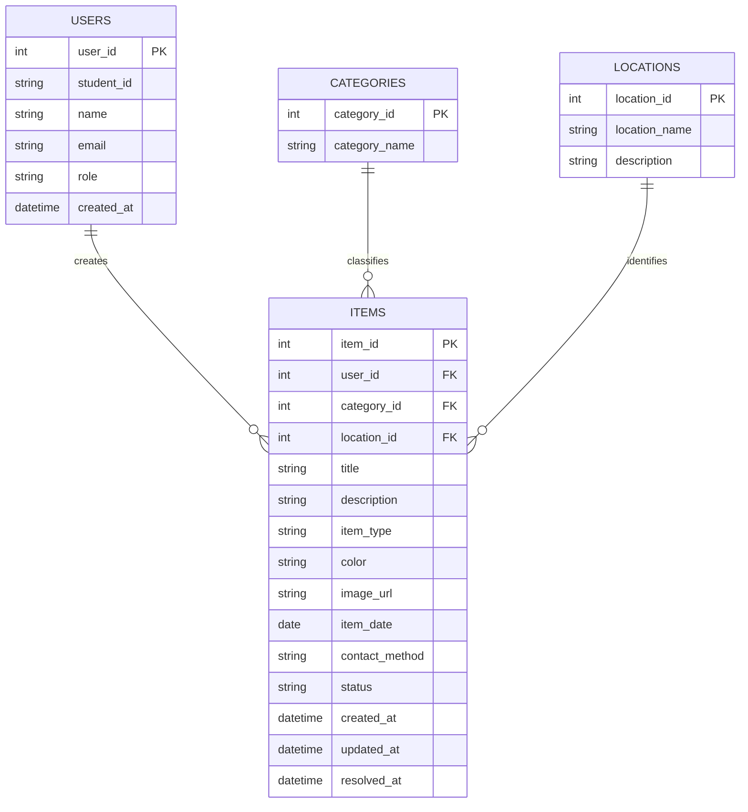

# Database Design

## 1. Database Overview

The **Smart Campus Lost & Found Website** uses a relational database to store and manage information about lost and found items on campus.

The database is designed to help students and university staff:

- Submit lost-item reports.
- Submit found-item reports.
- Search and filter reported items.
- View detailed information about an item.
- Contact the person who reported an item.
- Update the status of an item when it is returned or resolved.

The database is designed to be simple, reliable, and suitable for the MVP version of the project.

---

## 2. Database Design Objectives

The main objectives of the database are:

- Store accurate information about lost and found items.
- Separate item categories and campus locations into reusable records.
- Allow each report to be connected to the user who created it.
- Track whether an item is Lost, Found, or Resolved.
- Make searching and filtering efficient.
- Avoid storing unnecessary personal information.
- Maintain data consistency using primary keys and foreign keys.
- Support future expansion of the system.

---

## 3. Main Entities

The MVP database contains four main entities:

| Entity       | Purpose                                                             |
| ------------ | ------------------------------------------------------------------- |
| `users`      | Stores basic information about students, staff, and administrators. |
| `items`      | Stores all lost and found item reports.                             |
| `categories` | Stores item categories such as Electronics, Bags, and Keys.         |
| `locations`  | Stores campus locations where items were lost or found.             |

The database keeps the design simple by using the `items` table for both lost and found reports. The `item_type` field identifies whether a report is for a lost or found item.

---

## 4. Entity Relationship Diagram



---

## 5. Table Design

### 5.1 Users Table

The `users` table stores the basic information of people who create reports or manage the website.

| Column       | Data Type    | Rules                      | Description                    |
| ------------ | ------------ | -------------------------- | ------------------------------ |
| `user_id`    | INT          | Primary key                | Unique user identifier         |
| `student_id` | VARCHAR(30)  | Unique, optional for staff | University student/staff ID    |
| `name`       | VARCHAR(100) | Required                   | User's display name            |
| `email`      | VARCHAR(150) | Required, unique           | User email address             |
| `role`       | VARCHAR(20)  | Required                   | `student`, `staff`, or `admin` |
| `created_at` | TIMESTAMP    | Required                   | Account creation date          |

---

### 5.2 Categories Table

The `categories` table stores the types of items that can be reported.

| Column          | Data Type    | Rules            | Description                 |
| --------------- | ------------ | ---------------- | --------------------------- |
| `category_id`   | INT          | Primary key      | Unique category identifier  |
| `category_name` | VARCHAR(100) | Required, unique | Name of the item category   |
| `description`   | TEXT         | Optional         | Explanation of the category |

### Example Categories

- Electronics
- Wallets
- Keys
- Bags
- Student ID
- Books
- Clothing
- Accessories
- Stationery
- Other

---

### 5.3 Locations Table

The `locations` table stores common university locations where an item may have been lost or found.

| Column          | Data Type    | Rules            | Description                 |
| --------------- | ------------ | ---------------- | --------------------------- |
| `location_id`   | INT          | Primary key      | Unique location identifier  |
| `location_name` | VARCHAR(150) | Required, unique | Campus location             |
| `description`   | TEXT         | Optional         | Additional location details |

### Example Locations

- Library
- Cafeteria
- Classroom Building
- Computer Lab
- Student Center
- Dormitory
- Sports Center
- Parking Area
- Other

---

### 5.4 Items Table

The `items` table is the main table of the Lost & Found system. It stores both lost-item and found-item reports.

| Column           | Data Type    | Rules       | Description                                     |
| ---------------- | ------------ | ----------- | ----------------------------------------------- |
| `item_id`        | INT          | Primary key | Unique report ID                                |
| `user_id`        | INT          | Foreign key | User who created the report                     |
| `category_id`    | INT          | Foreign key | Category of the item                            |
| `location_id`    | INT          | Foreign key | Location where item was lost/found              |
| `title`          | VARCHAR(150) | Required    | Short name of the item                          |
| `description`    | TEXT         | Required    | Detailed description                            |
| `item_type`      | VARCHAR(10)  | Required    | `LOST` or `FOUND`                               |
| `color`          | VARCHAR(50)  | Optional    | Main color of the item                          |
| `image_url`      | TEXT         | Optional    | Uploaded item image                             |
| `item_date`      | DATE         | Required    | Date item was lost/found                        |
| `contact_method` | VARCHAR(150) | Required    | Contact information or preferred contact method |
| `status`         | VARCHAR(20)  | Required    | `ACTIVE` or `RESOLVED`                          |
| `created_at`     | TIMESTAMP    | Required    | Report creation time                            |
| `updated_at`     | TIMESTAMP    | Required    | Last update time                                |
| `resolved_at`    | TIMESTAMP    | Optional    | Date the report was resolved                    |

---

## 6. Relationships

The database uses the following relationships:

### User → Items

One user can create many item reports.

```text
One User → Many Items
```

For example, a student may report their lost wallet and later report a phone that they found.

### Category → Items

One category can be associated with many item reports.

```text
One Category → Many Items
```

For example, the `Electronics` category may contain phones, laptops, earbuds, and chargers.

### Location → Items

One campus location can be associated with many reports.

```text
One Location → Many Items
```

For example, several lost and found items may have been reported at the Library.

---

## 7. Data Rules

The following rules maintain data consistency:

- Every item must have a unique `item_id`.
- Every item must belong to one category.
- Every item must have one campus location.
- Every item must have a report type of `LOST` or `FOUND`.
- Every item must have a status of `ACTIVE` or `RESOLVED`.
- Every report must contain an item title and description.
- A user can create multiple reports.
- A category can contain multiple reports.
- A location can contain multiple reports.
- A resolved report should not appear in the default active-item search.
- A user's email should be unique.
- Deleted or invalid reports should be handled by an authorized administrator.

---

## 8. PostgreSQL Database Schema

The following schema represents the database design for the MVP.

```sql
CREATE TABLE users (
    user_id SERIAL PRIMARY KEY,
    student_id VARCHAR(30) UNIQUE,
    name VARCHAR(100) NOT NULL,
    email VARCHAR(150) NOT NULL UNIQUE,
    role VARCHAR(20) NOT NULL DEFAULT 'student',
    created_at TIMESTAMP NOT NULL DEFAULT CURRENT_TIMESTAMP,

    CONSTRAINT users_role_check
        CHECK (role IN ('student', 'staff', 'admin'))
);

CREATE TABLE categories (
    category_id SERIAL PRIMARY KEY,
    category_name VARCHAR(100) NOT NULL UNIQUE,
    description TEXT
);

CREATE TABLE locations (
    location_id SERIAL PRIMARY KEY,
    location_name VARCHAR(150) NOT NULL UNIQUE,
    description TEXT
);

CREATE TABLE items (
    item_id SERIAL PRIMARY KEY,

    user_id INT NOT NULL
        REFERENCES users(user_id),

    category_id INT NOT NULL
        REFERENCES categories(category_id),

    location_id INT NOT NULL
        REFERENCES locations(location_id),

    title VARCHAR(150) NOT NULL,

    description TEXT NOT NULL,

    item_type VARCHAR(10) NOT NULL,

    color VARCHAR(50),

    image_url TEXT,

    item_date DATE NOT NULL,

    contact_method VARCHAR(150) NOT NULL,

    status VARCHAR(20) NOT NULL DEFAULT 'ACTIVE',

    created_at TIMESTAMP NOT NULL DEFAULT CURRENT_TIMESTAMP,

    updated_at TIMESTAMP NOT NULL DEFAULT CURRENT_TIMESTAMP,

    resolved_at TIMESTAMP,

    CONSTRAINT items_type_check
        CHECK (item_type IN ('LOST', 'FOUND')),

    CONSTRAINT items_status_check
        CHECK (status IN ('ACTIVE', 'RESOLVED'))
);
```

---

## 9. Search Optimization

Indexes are added to frequently searched fields so that users can find reports efficiently.

```sql
CREATE INDEX idx_items_category
    ON items(category_id);

CREATE INDEX idx_items_location
    ON items(location_id);

CREATE INDEX idx_items_type
    ON items(item_type);

CREATE INDEX idx_items_status
    ON items(status);

CREATE INDEX idx_items_date
    ON items(item_date);
```

These indexes support common operations such as:

- Search Lost items.
- Search Found items.
- Filter by category.
- Filter by campus location.
- Display only active reports.
- Sort or filter reports by date.

---

## 10. Example Data

### Example User

```json
{
  "user_id": 1,
  "student_id": "SU2026001",
  "name": "Example Student",
  "email": "student@example.com",
  "role": "student"
}
```

### Example Lost Item

```json
{
  "item_id": 101,
  "title": "Black Backpack",
  "description": "Black backpack containing two notebooks and a laptop charger.",
  "item_type": "LOST",
  "category": "Bags",
  "location": "University Library",
  "color": "Black",
  "item_date": "2026-08-28",
  "status": "ACTIVE"
}
```

### Example Found Item

```json
{
  "item_id": 102,
  "title": "Student ID Card",
  "description": "University student ID card found near the cafeteria.",
  "item_type": "FOUND",
  "category": "Student ID",
  "location": "Cafeteria",
  "color": "White",
  "item_date": "2026-08-28",
  "status": "ACTIVE"
}
```

---

## 11. Database Operations

The website will perform the following main database operations:

| Operation | Purpose                                       |
| --------- | --------------------------------------------- |
| Create    | Add a new lost or found report                |
| Read      | Display item reports and details              |
| Search    | Find reports by keywords                      |
| Filter    | Filter by category, location, type, or status |
| Update    | Edit report information or status             |
| Resolve   | Mark an item as returned/resolved             |
| Delete    | Remove inappropriate or invalid reports       |

These operations support the main CRUD functions required by the MVP.

---

## 12. Privacy and Security

The database should protect user information by following these rules:

- Passwords must never be stored as plain text if authentication is implemented.
- Passwords should be stored using a secure hashing algorithm.
- Database credentials must be stored in environment variables.
- Database credentials and API keys must not be committed to GitHub.
- SQL queries should use parameterized queries or a trusted ORM.
- Users should not be asked to provide unnecessary sensitive information.
- Passport numbers, financial information, passwords, and other sensitive information should not be stored in item descriptions.
- Contact information should only be used for communication related to the report.
- Administrator functions should only be accessible to authorized users.
- Test data should not contain real students' private information.

---

## 13. Future Database Improvements

The following database features are not required for the MVP but could be added in future versions:

- Automatic lost/found item matching.
- Notification records.
- User messaging.
- Claim request management.
- Item report history.
- Favorite or saved items.
- University authentication integration.
- Audit logs for administrator actions.

These features will be considered through the Agile product backlog rather than included in the initial MVP.

---

## 14. Database Design Summary

The database is intentionally designed around four core tables: `users`, `items`, `categories`, and `locations`.

The `items` table is the central table because it connects users, categories, and campus locations. Using one item table for both lost and found reports keeps the MVP simple while still supporting searching, filtering, reporting, and status management.

This design provides a practical foundation for the **Smart Campus Lost & Found Website** and can be expanded later as new requirements are prioritized.
